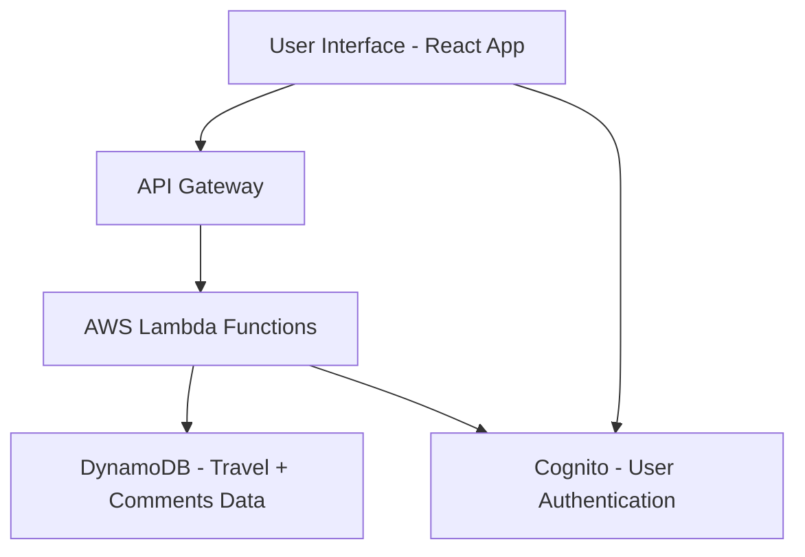

# aussie-travel-explorer

Aussie Travel Explorer is a modern serverless web application designed to provide users with a rich, immersive platform for discovering Australian travel experiences. Built with a cloud-native architecture, it combines an intuitive frontend with a powerful backend to support dynamic content, user authentication, and scalable data management—without relying on traditional servers.

---

## Table of Contents

- [Project Overview](#project-overview)
- [Live Demo](#live-demo)
- [Features](#features)
- [Tech Stack](#tech-stack)
- [Architecture Overview](#architecture-overview)
- [Screenshots](#screenshots)
- [Setup Instructions](#setup-instructions)
- [API Endpoints](#api-endpoints)
- [Folder Structure](#folder-structure)
- [Testing](#testing)
- [Author](#author)

---

## Project Overview

**Aussie Travel Explorer** is a responsive, interactive platform that helps travelers explore Australia through curated destination listings, user-submitted comments, and culturally rich travel guides. It is powered by a fully serverless backend, enabling seamless scalability, reduced infrastructure costs, and near-zero maintenance.

Users can:
- View and search travel listings
- Explore detailed information about destinations
- Register, log in, and leave comments
- Access the platform securely via AWS Cognito authentication

Whether you're a tourist, content creator, or travel blogger, Aussie Travel Explorer provides a vibrant digital space to discover, engage, and share Australian adventures.

---

## Live Demo

> Coming Soon – Deployed via AWS Amplify (Link to be provided)

---

##  Features

| Type         | Description                                                                 |
|--------------|-----------------------------------------------------------------------------|
| Frontend   | Built with React and TypeScript, featuring responsive layouts and dynamic routing |
| Authentication | AWS Cognito + Amplify UI to handle user sign-up, sign-in, and session persistence |
| Travel Listings | View, filter, and explore curated Australian destinations |
| Comments     | Authenticated users can leave comments on travel pages                  |
| Serverless API | Node.js RESTful API hosted on AWS Lambda + API Gateway                |
| Database     | DynamoDB used to store destinations and user comments                    |
| UI/UX       | Designed using Figma with both Lo-Fi and Hi-Fi wireframes                 |

---

## Tech Stack

### Frontend
- React (with TypeScript)
- AWS Amplify UI (pre-built authentication components)
- Axios (API communication)
- React Router

### Backend (Serverless)
- AWS Lambda (function compute)
- Amazon API Gateway (exposes endpoints)
- Amazon DynamoDB (NoSQL database)
- AWS Cognito (user authentication)

### Dev Tools
- Git + GitHub (version control)
- Amplify CLI (for infrastructure setup)
- Postman (API testing)
- Figma (UI/UX design)
- Jest (frontend testing)

---

## Architecture Overview


## Architecture Overview

**Frontend**: Interacts with the user and communicates with the backend via RESTful APIs.

**API Gateway**: Routes HTTP requests to appropriate Lambda functions.

**Lambda**: Executes business logic and handles CRUD operations.

**DynamoDB**: Stores travel listings and comments.

**Cognito**: Secures the platform with sign-up, login, and user session management.

---

## Screenshots

Coming soon: include UI mockups and app screenshots (optional)

---

## Setup Instructions

### Prerequisites

- Node.js v18+
- Git
- AWS CLI
- Amplify CLI (`npm install -g @aws-amplify/cli`)
- AWS Account with appropriate IAM permissions

---

### 1. Clone the Repository

```
git clone https://github.com/<your-username>/aussie-travel-explorer.git
cd aussie-travel-explorer
npm install
```
2. Configure Amplify (Initial Setup)

```
amplify configure   # One-time AWS setup (opens browser)
amplify init        # Initializes Amplify in the project
amplify add auth    # Adds AWS Cognito for user auth
amplify add api     # Adds a REST API using Lambda + DynamoDB
amplify push        # Deploys backend infrastructure to AWS
```
3. Run Locally
```
npm start
The application will be available at http://localhost:3000.
```

## API Endpoints 
- Method	Endpoint	Description
- GET	/travel-items	Fetch all travel listings
- GET	/travel-items/:id	Fetch a single destination
- POST	/comments/:id	Submit a comment (auth only)
- GET	/comments/:id	Fetch comments for a post

Authenticated endpoints require a valid Cognito token

## Folder Structure
```pgsql

aussie-travel-explorer/
├── src/
│   ├── components/       # Reusable components
│   ├── pages/            # App pages (Home, Detail)
│   ├── services/         # API logic
│   ├── aws-exports.js    # Amplify configuration
│   └── App.tsx           # Main app wrapper
├── amplify/              # AWS backend infra
├── public/
├── README.md
└── package.json
```
## Testing
**Frontend:** Unit tests using Jest and React Testing Library

**Backend:** Endpoint testing using Postman

**Manual QA:** Simulate user actions (login, comment, fetch listings)

**Test cases include:**

- Authentication success/failure
- Invalid data handling
- Response time checks
- Future Enhancements
- Google Maps API integration

User-submitted destinations (UGC)

Dark mode toggle

Analytics dashboard (admin-only)

Travel package bookings with Stripe integration
